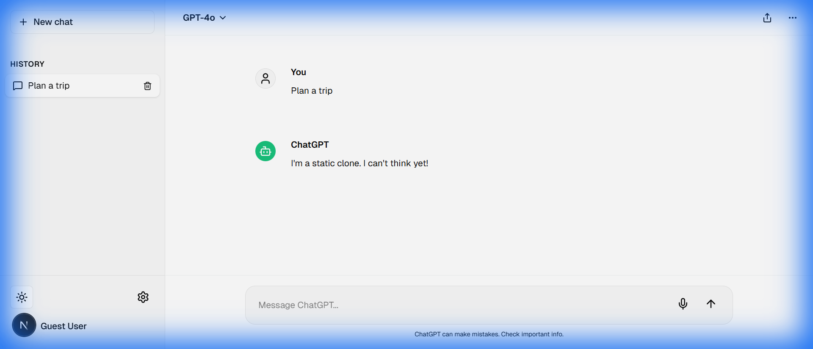
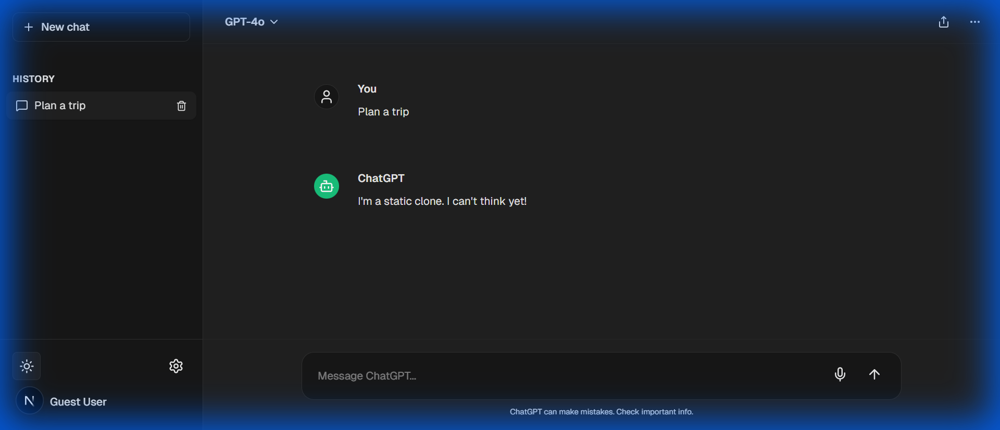

# ChatGPT Clone

A modern, responsive ChatGPT-like web application frontend built with Next.js, Tailwind CSS, and Lucide React.




## Features
- **Mobile-First Design**: Fully responsive layout with a toggleable sidebar on mobile.
- **Theme Switching**: Seamless transition between Light and Dark modes.
- **Modern Interface**: Clean chat bubbles, auto-expanding input, and premium ChatGPT-like aesthetics.

## Getting Started

### Prerequisites
- Node.js (v18.x or later)
- npm (v9.x or later)

### Installation
Clone the repository and install the dependencies:
```bash
npm install
```

### Development
Start the development server:
```bash
npm run dev
```
Once the server is running, you can access the application at:
[http://localhost:3000](http://localhost:3000)

### Production
To create an optimized production build:
```bash
npm run build
```
To start the production server:
```bash
npm run start
```

## Tech Stack
- **Framework**: [Next.js](https://nextjs.org/) (App Router)
- **Styling**: [Tailwind CSS 4](https://tailwindcss.com/)
- **Icons**: [Lucide React](https://lucide.dev/)
- **Theming**: [next-themes](https://github.com/pacocoursey/next-themes)
